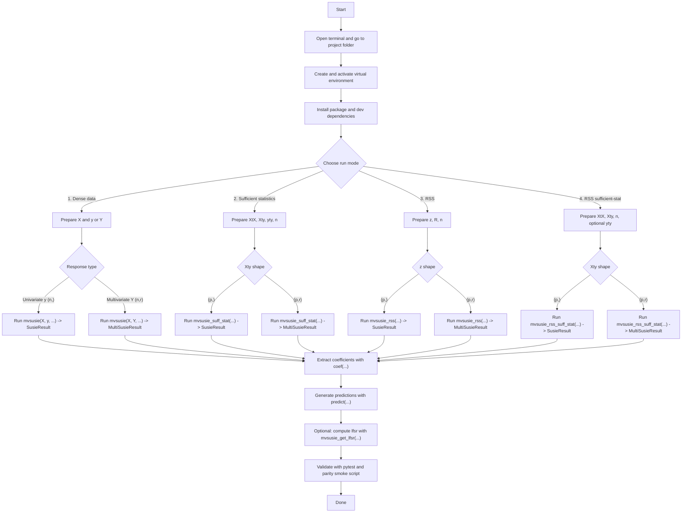

# Program Run Flowchart (Detailed)

This document shows the full run flow for `mvsusie-py`, then explains each step and decision point in detail.

## Flowchart



## Detailed Step-by-Step Instructions

## 1) Environment setup

Run from project root:

```bash
cd /Users/smankar2/Downloads/mvsusie-py
python3 -m venv .venv
source .venv/bin/activate
python -m pip install -U pip
python -m pip install -e ".[dev]"
```

Why:

- Creates an isolated environment.
- Installs this package in editable mode.
- Installs test dependencies.

## 2) Choose run mode

Pick based on what data you have:

- Dense mode (`mvsusie`): use when you have raw `X` and `y`/`Y`.
- Sufficient-stat mode (`mvsusie_suff_stat`): use when you already have `XtX`, `Xty`, `yty`, `n`.
- RSS mode (`mvsusie_rss`): use when you have summary z-scores and LD matrix `R`.
- RSS sufficient-stat mode (`mvsusie_rss_suff_stat`): use when you already converted RSS into sufficient-stat format.

## 3) Dense mode details (`mvsusie`)

### Inputs

- `X`: shape `(n, p)`
- `y`: shape `(n,)` for univariate
- `Y`: shape `(n, r)` for multivariate

### Important options

- `L`: number of single-effect components.
- `prior_variance`: effect-size prior variance.
- `mixture_prior`: optional `MixturePrior`; effective scalar prior becomes its weighted mean variance.
- `residual_variance`: scalar or `(r,)`; if `None`, auto-initialized.
- `estimate_residual_variance`: if `True`, updated during IBSS.
- `max_iter`, `tol`: iteration cap and convergence threshold.

### Example

```python
fit = mvsusie(X, y, L=10, residual_variance=1.0, estimate_residual_variance=False)
```

## 4) Sufficient-stat mode details (`mvsusie_suff_stat`)

### Inputs

- `XtX`: `(p,p)`
- `Xty`: `(p,)` univariate, `(p,r)` multivariate
- `yty`: scalar (univariate) or `(r,)` (multivariate)
- `n`: sample size

### Example

```python
fit_ss = mvsusie_suff_stat(XtX, Xty, yty, n=n, L=10)
```

## 5) RSS mode details (`mvsusie_rss`)

### Inputs

- `z`: `(p,)` or `(p,r)`
- `R`: `(p,p)`
- `n`: sample size

### Internal conversion

- `z_tilde = z / sqrt(1 + z^2 / n)`
- `XtX = n * R`
- `Xty = sqrt(n) * z_tilde`
- `yty = n` (or vector of `n` in multivariate)

### Example

```python
fit_rss = mvsusie_rss(z, R, n=n, L=10)
```

## 6) RSS sufficient-stat mode (`mvsusie_rss_suff_stat`)

Use when you already have RSS-style sufficient stats.

### Inputs

- `XtX`, `Xty`, `n`
- optional `yty`

If `yty=None`, it defaults to:

- `n` for univariate
- `[n] * r` for multivariate

### Example

```python
fit_rss_ss = mvsusie_rss_suff_stat(XtX, Xty, n=n)
```

## 7) Post-fit outputs

### Coefficients

```python
b = coef(fit)
b_i = coef(fit, include_intercept=True)
```

Shapes:

- univariate: `(p,)` or `(p+1,)`
- multivariate: `(p,r)` or `(p+1,r)`

### Predictions

```python
yhat = predict(fit, X_new)
```

Shapes:

- univariate: `(n_new,)`
- multivariate: `(n_new,r)`

### LFSR

```python
lfsr = mvsusie_get_lfsr(fit)
```

Shapes:

- univariate: `(p,)`
- multivariate: `(p,r)`

## 8) Validation commands

```bash
source .venv/bin/activate
PYTHONPATH=src python -m pytest -q
PYTHONPATH=src python scripts/parity_smoke.py
```

## 9) Common errors and fixes

- `ModuleNotFoundError: mvsusie_py`
  - Re-run `python -m pip install -e ".[dev]"` or set `PYTHONPATH=src`.
- Shape mismatch errors
  - Ensure row counts align (`X`, `y`, `Y`) and first dimensions align (`XtX`, `Xty`, `z`, `R`).
- Non-positive variance errors
  - Use positive `prior_variance` and `residual_variance`.
